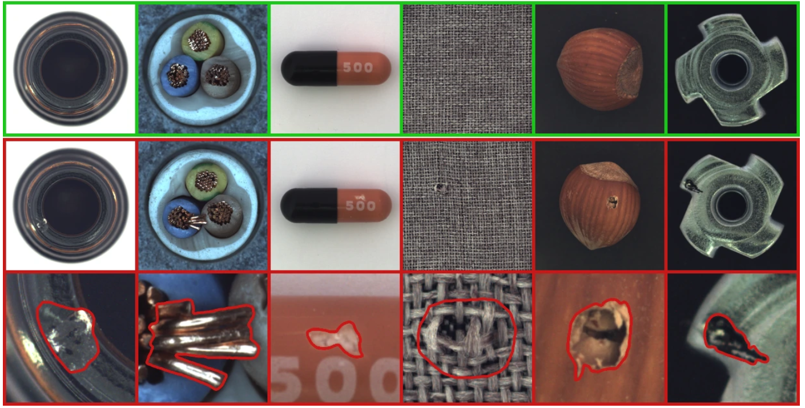

[![LinkedIn][linkedin-shield]][linkedin-url]


# MVTec Anomaly Detection Project
[](link-to-your-repo)

  
## 📌 Project Overview
This project aims to implement **anomaly detection** using the **MVTec Anomaly Detection Dataset**. It applies various machine learning and deep learning techniques, including **ResNet50 feature extraction**, **KNN-based anomaly scoring**, **Autoencoder**, and **synthetic data generation** to improve model performance.

📌 **Live Demo**: [MVTec Website](https://huggingface.co/spaces/pepperumo/MVTec_Website)

---

## 🔍 Dataset
The **MVTec Anomaly Detection Dataset** consists of **15 categories** of industrial components and textures. Each category includes:

- **Normal images** (defect-free)
- **Anomalous images** (with various real-world defects)

To improve model training and validation, the dataset has been **pre-processed**, and additional **synthetic and augmented data** have been generated.  
You can download the dataset directly from the [official MVTec website](https://www.mvtec.com/company/research/datasets/mvtec-ad).

---

## 🏗️ Project Structure
------------
 
    ├── LICENSE
    ├── README.md          <- The top-level README for developers using this project.
    ├── data               <- to be dowloaded https://www.mvtec.com/company/research/datasets/mvtec-ad
    │
    ├── models             <- Trained and serialized models, model predictions, or model summaries
    │
    ├── notebooks          <- Jupyter notebooks.
    │
    ├── bibliography       <- Data dictionaries, manuals, links, and all other explanatory materials.
    │
    ├── reports            <- The reports 
    │   └── figures        <- Generated graphics and figures to be used in reporting
    │
    ├── environment.yml   <- The yaml file for conda environment: requirements
    │
    ├── src                <- Source code for use in this project.
    │   ├── __init__.py    <- Makes src a Python module
    │   │
    │   ├── features       <- Scripts to turn raw data into features for modeling
    │   │
    │   ├── models         <- Scripts to train models and then use trained models to make predictions              
    │   │
    │   ├── streamlit  <- Streamlit presentation
    │   │
    │   ├── visualization  <- Scripts to create exploratory and results oriented visualizations
    │   │   

--------

## 📊 Exploratory Data Analysis & Preprocessing

1. **Feature Extraction:** Utilizes **ResNet50** for deep feature representation.
2. **PCA Dimensionality Reduction:** PCA retains **95%** of variance, which reduces computation time while preserving key data characteristics.
3. **Dataset Augmentation:** Created **1500 augmented images per category** using transformations like flipping, scaling, rotation, and Gaussian blur.

---

## 🛠️ Machine Learning Models


### 1. Classical Machine Learning Models + ResNet50
- **OC-SVM (One-Class SVM):**  
  Learns a boundary around the “normal” data in the extracted feature space.

- **Isolation Forest:**  
  Uses a random partitioning process to isolate outliers in the feature representation.

- **LOF (Local Outlier Factor):**  
  Computes local density deviations to flag anomalies based on the feature vectors.

- **Elliptic Envelope:**  
  Assumes a Gaussian distribution and detects points deviating from it within the extracted features.

### 2. KNN + ResNet50 Feature Extraction
- **KNN (k=1)** computes anomaly scores by measuring distances in feature space.
- A **memory bank** of normal samples facilitates efficient lookups.
- **Euclidean distance** from nearest neighbors determines the anomaly score, with a threshold tuned for optimal F1-score.

### 3. Autoencoder + ResNet50 Feature Extraction
- An **Encoder-Decoder** network is trained on normal image feature vectors.
- **Reconstruction error** (difference between original and reconstructed features) indicates anomalies.
- A threshold based on error distribution balances recall and precision.

---

## 🔬 Synthetic Data vs. Augmented Data

- **Synthetic Data**:
  - Created by injecting artificial distortions into normal images.
  - Broadens validation sets when real anomaly samples are limited.

- **Augmented Data**:
  - Offline augmentation using flips, rotations, scaling, and Gaussian noise.
  - **1500 augmented images per category** were pre-generated to improve training diversity.

---

## 📈 Results & Evaluation

- **Primary Metric:** **AUC-ROC** (Area Under the ROC Curve).
- **Threshold Optimization:** F1-score was used to pick an anomaly detection cutoff.
- **Model Comparisons:** Assessed via AUC-ROC for each method (OC-SVM, Isolation Forest, LOF, Elliptic Envelope, and KNN with ResNet50 features).
- **Visualization:** Anomaly score histograms reveal a marked gap between normal and anomalous data.

[](link-to-your-repo)
---

## 🚀 How to Run the Project

1. **Clone the repository**:
   ```bash
   git clone https://github.com/DataScientest-Studio/nov24_bds_mvtec-anomaly-detection.git

2. **Install dependencies**:
   ```bash
   pip install -r requirements.txt

3. **Explore and train**:
    - Navigate to notebooks/
    - Launch Jupyter notebooks to run data exploration and training scripts.


## 📌 References
- Liu, J., Xie, G., Wang, J., Li, S., Wang, C., Zheng, F., & Jin, Y. (2023). Deep Industrial Image Anomaly Detection: A Survey. Springer Nature. [arXiv:2301.11514].
- Yang, J., Shi, Y., & Qi, Z. (2020). DFR: Deep Feature Reconstruction for Unsupervised Anomaly Segmentation. [arXiv:2012.07122].

<!-- MARKDOWN LINKS & IMAGES -->
[linkedin-shield]: https://img.shields.io/badge/-LinkedIn-black.svg?style=flat-square&logo=linkedin&colorB=555
[linkedin-url]: https://www.linkedin.com/in/giuseppe-rumore-b2599961
- Bühler, J., Fehrenbach, J., Steinmann, L., Nauck, C., & Koulakis, M. (2024). Domain-independent detection of known anomalies. Karlsruhe Institute of Technology (KIT) & preML GmbH. [arXiv:2407.02910].
- Rippel, O., Mertens, P., & Merhof, D. (2020). Modeling the Distribution of Normal Data in Pre-Trained Deep Features for Anomaly Detection. RWTH Aachen University. [arXiv:2005.14140].
- Bergmann, P., Fauser, M., Sattlegger, D., & Steger, C. (2019). MVTec AD – A Comprehensive Real-World Dataset for Unsupervised Anomaly Detection. MVTec Software GmbH. www.mvtec.com.
- Roth, K., Pemula, L., Zepeda, J., Schölkopf, B., Brox, T., & Gehler, P. (2022). Towards Total Recall in Industrial Anomaly Detection. University of Tübingen & Amazon AWS. [arXiv:2106.08265].
- Zheng, Y., Wang, X., Qi, Y., Li, W., & Wu, L. (2022). Benchmarking Unsupervised Anomaly Detection and Localization. University of Chinese Academy of Sciences, SenseTime Research, & Tsinghua University. [arXiv:2205.14852].
